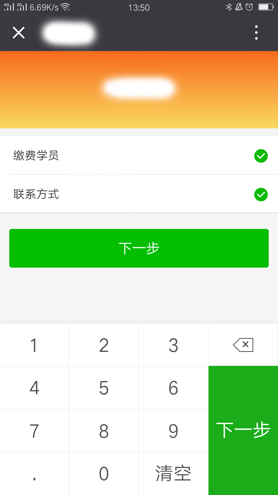

# keyboardnumber

[github仓库-求关注-求点心](https://github.com/plingply/keyboard-number)
[测试地址，请用手机打开 http://jtutu.cn/keyboard](http://jtutu.cn/keyboard)

### 预览效果



### 使用方法：
```javascript

//安装
npm install keyboard-number --save
//在项目中引入
import 'keyboard-number/dist/style.css';
import keyboardnumber from "keyboard-number";
Vue.use(keyboardnumber)

//在项目中使用
<keyboard-number @callback="keyboardcallbak" @paycallbakc="paycallbakc"></keyboard-number>

```

### props:
 ```javascript
  //type默认pay，pay表示金额 phone 表示电话 sfz 表示身份证
	type: {
		type: String,
		default: 'pay'
	},
	// 控制键盘显示 隐藏
	show: {
		type: Boolean,
		default: true
	},
	//控制 右下角按钮是否可点击
	disabled: {
		type: Boolean,
		default: false
	},
	//传入给键盘的默认值
	value: {
		type: String,
		default: ''
	},
	// text 右下角大按钮文字
	text: {
		type: String,
		default: "支付"
	},
	// bgcolor 右下角大按钮 背景颜色
	bgcolor: {
		type: String,
		default: "#1AAD19"
	},
	// textcolor 右下角大按钮文字颜色
	textcolor: {
		type: String,
		default: "#fff"
	},
	//限制整数位的位数
	len: {
		type: Number,
		default: 5
	}
 ```

### methods
 ```javascript
	 @callback
	 按下数字键 回调
	 @paycallback
	 右下角按钮回调
 ```